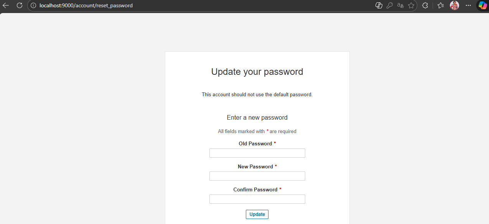
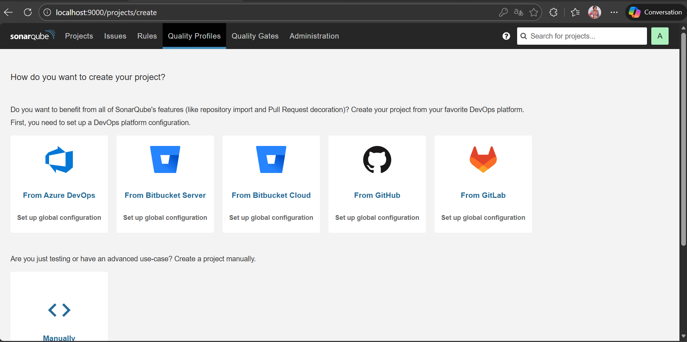

# Dépôt des sources JAVA pour cours CICD 

## Sonar

Logiciel qui s'appuie sur un ensemble de scanner , propres à chaque techno pour collecter les métriques de code

et les publier pour exploitation sur dans interface graphique

Schéma:


## Installation du serveur en local:

### a/ Récupérer l'image du serveur sonar

https://hub.docker.com/_/sonarqube/

```bash 
    docker pull sonarqube:lts
```

### b/ Démarrer le serveur sonar:

```bash 
    docker run --name sonarqube -e SONAR_ES_BOOTSTRAP_CHECKS_DISABLE=true -p 9000:9000 sonarqube:lts
```

Il faudra récupérer son IP machine

Les credentials par defaut sont **admin/admin**, il faudra changer le mot de passe initial. Mettre **My_pa55word** pour ne pas trop chercher après.



Une fois les crédentials validés, on a l'interface de Sonar qui apparait : 




## Collecte des métriques et publication sur le serveur SonarQube

SonarQube s'appuie sur des scanners pour analyser le code.

## Configuration du SonarScanner pour Maven

Les SonarScanner disponibles par défaut sont à [cette URL](https://docs.sonarsource.com/sonarqube/latest/analyzing-source-code/scanners/sonarscanner-for-maven/). À cette adresse, on peut observer des scanners pour différents projets. Nous en est sur **Maven**.

> **Note :** Notre serveur SonarQube tourne localement dans un conteneur Docker, accessible par défaut à l'adresse `http://localhost:9000`

### Télécharger le Token d'authentification afin de se connecter au serveur et y publier les résultats

Adminitration > Security > Users > Token

Copier et sauvegarder!

### Méthode 1 : Configuration dans le projet (recommandé)

Ajoutez les propriétés suivantes dans votre `pom.xml` :

```xml
<properties>
  <sonar.host.url>http://localhost:9000</sonar.host.url>
</properties>
```

Si vous utilisez l'authentification par token :

```xml
<properties>
  <sonar.host.url>http://localhost:9000</sonar.host.url>
  <sonar.token>votre_token_ici</sonar.token>
</properties>
```

### Méthode 2 : Configuration en ligne de commande

Lancez l'analyse directement avec les paramètres :

```bash
mvn clean verify sonar:sonar \
  -Dsonar.host.url=http://localhost:9000 \
  -Dsonar.token=votre_token
```

### Méthode 3 : Configuration via settings.xml (ancienne méthode)

La configuration demande de créer un répertoire `.m2` dans lequel on dépose un fichier de configuration `settings.xml`.

Créez le fichier `~/.m2/settings.xml` (ou `%USERPROFILE%\.m2\settings.xml` sous Windows) :

```xml
<settings>
  <pluginGroups>
    <pluginGroup>org.sonarsource.scanner.maven</pluginGroup>
  </pluginGroups>
  <profiles>
    <profile>
      <id>sonar</id>
      <properties>
        <sonar.host.url>http://localhost:9000</sonar.host.url>
        <sonar.token>votre_token</sonar.token>
      </properties>
    </profile>
  </profiles>
  <activeProfiles>
    <activeProfile>sonar</activeProfile>
  </activeProfiles>
</settings>
```

## Lancer l'analyse

Une fois la configuration effectuée, lancez l'analyse avec :

```bash
mvn clean verify sonar:sonar
```

## Prérequis

- Maven 3.x
- Au moins la version minimale de Java supportée par votre serveur SonarQube

## Ressources

- [Documentation officielle SonarScanner for Maven](https://docs.sonarsource.com/sonarqube/latest/analyzing-source-code/scanners/sonarscanner-for-maven/)
- [Documentation SonarQube](https://docs.sonarsource.com/sonarqube/)

## Notes

- Le token d'authentification peut être généré depuis votre compte SonarQube : **Mon compte → Sécurité → Générer un token**
- Pour des raisons de sécurité, évitez de commiter le token dans votre `pom.xml`. Privilégiez l'utilisation de variables d'environnement ou de `settings.xml`


### C/ Lancer l'analyse en spécifiant l'emplacement du fichier de configurations

mvn sonar:sonar -s .m2/settings.xml -Dsonar.login=<token>


### d/ Corrigeons quelques bugs signalés


### e/ Définition des seuils

Quality Gate = Seuil de métriques au delà des quelles le code n'est pas considéré comme de qualité

Quality Profile = Ensemble de règle définissant, pour un langage précis quelles sont erreurs à détecter

Nous allons utiliser les Quality profile et Quality Gate par défaut définis par Sonar


### f/ Définir les taux de couverture avec Jacoco dans le projet

Echec du Quality Gate car le % de tests est < 80 %

Documentation: https://www.jacoco.org/jacoco/trunk/doc/maven.html

Ajouter le plugin à notre projet:

    <plugin>
      <groupId>org.jacoco</groupId>
      <artifactId>jacoco-maven-plugin</artifactId>
      <version>0.8.2</version>
    </plugin>
	
Les plugins maven fonctionnent grâce à des exécutions, qui peuvent être rattachées à des phases du cycle de vie maven.
Ex si la phase test est rattachée à l'exécution génération de rapport, alors les rapports seront générés juste après la phase de tests.
Si l'exécution n'est pas rattachée à une phase alors elle s'exécute quelque soit la phase en cours.


		<executions>
            <execution>
                <goals>
                    <goal>prepare-agent</goal>
                </goals>
            </execution>
            <!-- attached to Maven test phase -->
            <execution>
                <id>report</id>
                <phase>test</phase>
                <goals>
                    <goal>report</goal>
                </goals>
            </execution>
        </executions>
		
		

Exécuter les tests:

mvn test puis ouvrir le fichier : target\site\index.html

Pousser de nouveau les métriques vers le serveur Sonar: mvn sonar:sonar -s .m2/settings.xml -Dsonar.login=<token>

Les taux globaux et du nouveau code s'affichent désormais.
