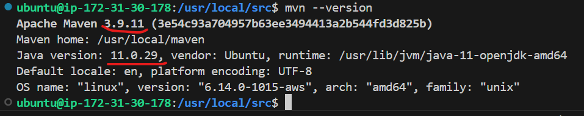
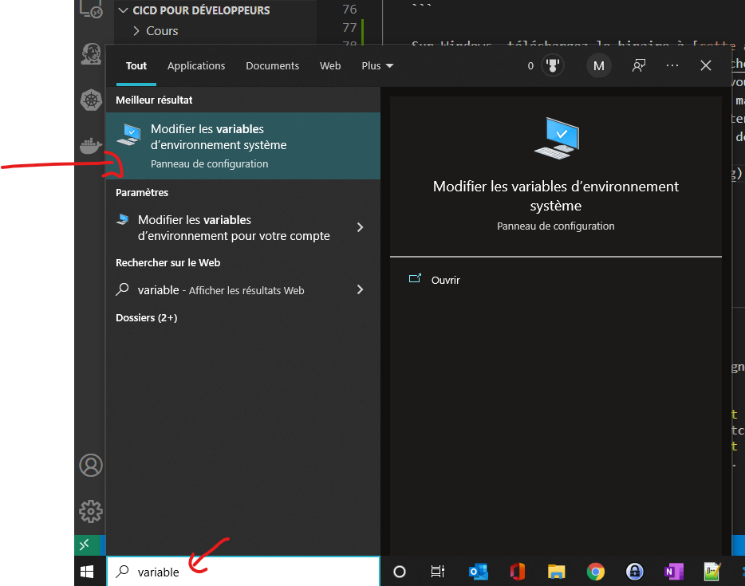
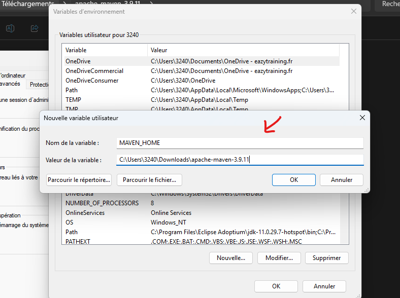
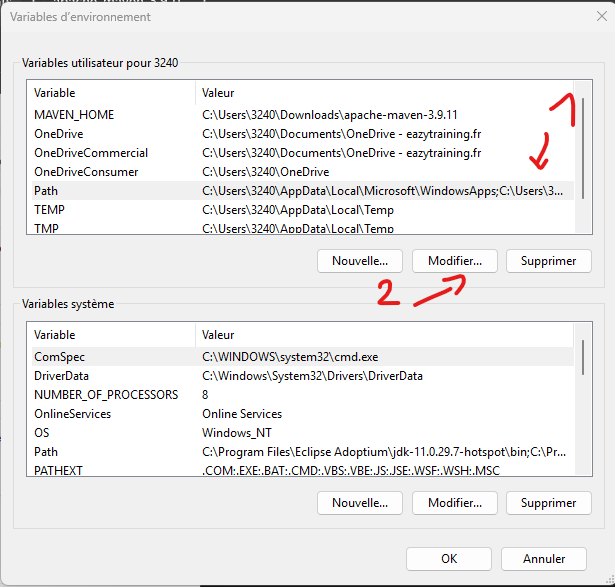
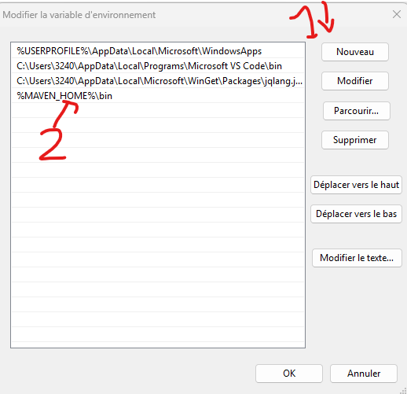
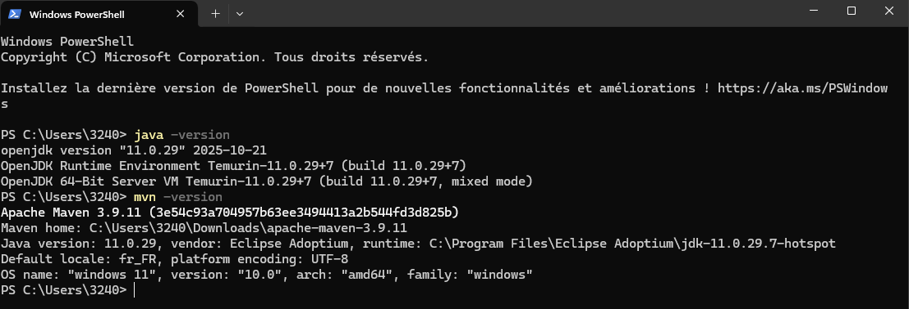

# Dépôt des sources JAVA pour cours CICD 

Sources accompagnant le cours "Continuous Integration, Continuous Delivery"
# Installation des outils dans un environnement Ubuntu 24.04

> Avant de démarrer les installations des différents outils, mettre à jour son environnement

    sudo apt update -y
    sudo apt upgrade -y

**Installation de Git et Vim**

    sudo apt install -y git vim

**Installation de Java 11**

    sudo apt install -y openjdk-11-jdk

Configuration de JAVA_HOME dans ~/.bashrc

On détecte automatiquement le chemin Java puis on l'ajoute à ~/.bashrc

> 
> Editer le fichier **vim ~/.bashrc** et y ajouter le contenu ci-dessous
```bash
    # Détection automatique du chemin JAVA_HOME
    JAVA_HOME_PATH=$(dirname $(dirname $(readlink -f $(which java))))

    # Sauvegarde du .bashrc
    cp ~/.bashrc ~/.bashrc.backup

    # Ajout de JAVA_HOME si pas déjà présent
    if ! grep -q "JAVA_HOME" ~/.bashrc; then
    echo "" >> ~/.bashrc
    echo "# Configuration Java" >> ~/.bashrc
    echo "export JAVA_HOME=$JAVA_HOME_PATH" >> ~/.bashrc
    echo "export PATH=\$PATH:\$JAVA_HOME/bin" >> ~/.bashrc
    fi

    source ~/.bashrc
    java -version
``` 

**Installation de Maven 3.9.11**

    cd /usr/local/src/

#### Téléchargement de Maven
```bash
    MAVEN_VERSION="3.9.11"
    MAVEN_URL="https://dlcdn.apache.org/maven/maven-3/${MAVEN_VERSION}/binaries/apache-maven-${MAVEN_VERSION}-bin.tar.gz" 

    sudo wget $MAVEN_URL

```
> Si l'execution de la commande, vous indique que le lien de récuperation des sources de maven n'existe pas, veuillez vous cliquez sur le lien suivant puis reconstruisez une URL valide.:
> https://downloads.apache.org/maven/ 
> Extraction et installation

```bash
    sudo tar -xzf apache-maven-${MAVEN_VERSION}-bin.tar.gz
    sudo mkdir -p /usr/local/maven
    sudo mv apache-maven-${MAVEN_VERSION}/* /usr/local/maven/
    sudo rm -rf apache-maven-${MAVEN_VERSION}
```
> Configuration de Maven (profil système)
```bash
    sudo tee /etc/profile.d/maven.sh > /dev/null <<EOF
    export M2_HOME=/usr/local/maven
    export PATH=\${M2_HOME}/bin:\${PATH}
    EOF

    sudo chmod +x /etc/profile.d/maven.sh
    source /etc/profile.d/maven.sh
```
> Ajout aussi dans ~/.bashrc (utilisateur courant) 
```bash
    if ! grep -q "M2_HOME" ~/.bashrc; then
    echo "" >> ~/.bashrc
    echo "# Configuration Maven" >> ~/.bashrc
    echo "export M2_HOME=/usr/local/maven" >> ~/.bashrc
    echo "export PATH=\${M2_HOME}/bin:\${PATH}" >> ~/.bashrc
    fi

    source ~/.bashrc
    mvn --version
```
> Vérification / Résumé

    sudo chmod +x /etc/profile.d/maven.sh
    source /etc/profile.d/maven.sh
    mvn --version
```bash
    git --version
    java -version
    mvn --version

    echo "JAVA_HOME: $JAVA_HOME"
    echo "M2_HOME: $M2_HOME"
```



Sous Windows 11

La machine de TP doit être suffisamment robuste. Nous recommandons une VM avec les ressources suivantes :
Installation de Java 11
Sous Windows 11

Télécharger Java 11

Rendez-vous sur le site d'Oracle ou d'Adoptium (OpenJDK) : https://adoptium.net/temurin/releases/?version=11

Téléchargez l'installeur Windows x64 pour Java 11 (JDK)
Exécutez l'installeur et suivez les instructions


Vérifier l'installation

Ouvrez un nouveau terminal (CMD ou PowerShell)
Tapez java -version pour vérifier que Java 11 est bien installé


Installation de Maven 3.9
Sous Windows 11

Télécharger Maven 3.9

Téléchargez le binaire à cette adresse


Extraire et configurer Maven

Extraire le fichier ZIP à l'emplacement que vous souhaitez (par exemple : C:\Users\votre_nom\apache-maven-3.9.11)

Ouvrez les variables d'environnement Windows



Créez une variable système nommée MAVEN_HOME contenant ce chemin (exemple : C:\Users\votre_nom\apache-maven-3.9.11)



Ajoutez %MAVEN_HOME%\bin à la variable d'environnement PATH





Vérifier l'installation

Ouvrez un nouveau terminal (CMD ou PowerShell)
Tapez mvn -version pour vérifier que Maven 3.9 est bien installé et utilise Java 11



Configuration des variables d'environnement Windows 11

Configuration de Docker

Créer un compte Docker Hub

Rendez-vous sur https://hub.docker.com/ si vous n'en avez pas encore un
Créez votre compte gratuitement


Installer Docker Desktop pour Windows 11

Téléchargez Docker Desktop depuis https://www.docker.com/products/docker-desktop/
Exécutez l'installeur
Assurez-vous que WSL 2 (Windows Subsystem for Linux) est activé si demandé
Redémarrez votre ordinateur si nécessaire
Lancez Docker Desktop et connectez-vous avec vos identifiants Docker Hub


Vérifier l'installation

Ouvrez un terminal
Tapez docker --version pour vérifier que Docker est bien installé
Tapez docker run hello-world pour tester que Docker fonctionne correctement